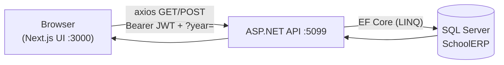
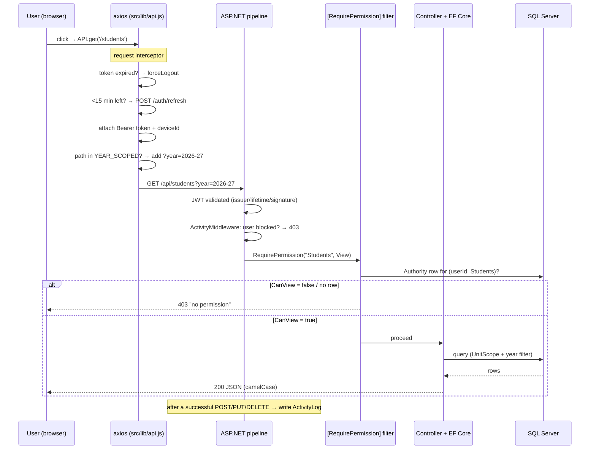

# School ERP — Architecture & Flow

How the whole system is wired together: the two apps, how a request travels from a click in the
browser to a row in SQL Server and back, and the four cross-cutting rules that govern every page
(**auth → RBAC → academic-year scoping → single-session**).

---

## 1. The two applications

| Layer | Tech | Location | Runs on |
|-------|------|----------|---------|
| **Backend API** | .NET 10 Web API, EF Core, SQL Server | `school erp/` | `http://localhost:5099` |
| **Frontend** | Next.js 15 (App Router), React 19 | `school-erp-next/` | `http://localhost:3000` |
| **Database** | SQL Server (`SchoolERP`) | full dump in `Database/` | local SQL Express |
| *(legacy)* | old React client | `school-erp-client/` | — (superseded by `school-erp-next`) |

The backend is a pure JSON API — opening `localhost:5099` in a browser shows nothing (404); it only
answers `/api/...` calls. The frontend is the UI and is the only thing a user opens.



---

## 2. The full request lifecycle

A single authenticated request (say, loading the student list) passes through this chain:



Everything hangs off the four rules below.

---

## 3. Rule 1 — Authentication (JWT)

**Login** (`POST /api/auth/login`, `AuthController`):

1. Look up user by `Username`, verify password with **BCrypt** against `PasswordHash`.
2. Reject if `!IsActive || IsBlocked`, or if the chosen **Unit** doesn't match the user's `UnitId`.
3. Run the single-session gate (Rule 4), open a `UserSession` row, write an `ActivityLog` "Login".
4. Issue a **JWT** signed HMAC-SHA256 with claims: `userId`, `email`, `Name`(username),
   `Role`, `unitId`, and `absExp` = **login + 8 hours** (an absolute cap).

The token's expiry **is** that 8-hour cap, so a token dies exactly 8h after login regardless of
activity. The frontend (`api.js`) proactively:
- **Force-logs-out** if the token is already expired (decodes the JWT client-side).
- **Silently refreshes** (`POST /auth/refresh`) when <15 minutes remain — but refresh is refused
  once the 8-hour `absExp` passes, forcing a real re-login.

Token validation happens in `Program.cs` via `AddJwtBearer` (issuer/audience/lifetime/signature,
`ClockSkew = 0`).

---

## 4. Rule 2 — Authorization (pure ID-based RBAC)

**There is no role hard-coding anywhere.** Access is decided entirely by rows in the **`Authorities`**
table — one row per `(User × Module)` with four booleans: `CanView`, `CanCreate`, `CanEdit`,
`CanDelete`.

**Enforcement** — every protected endpoint carries `[RequirePermission("Module", Action)]`
(`Helpers/RequirePermission.cs`, an `IAsyncActionFilter`):

1. Require an authenticated principal (else 401).
2. Read `userId` from the token.
3. Find the `Module` row by name. **Unknown module → fail-closed 403** (never a 500).
4. Load the `Authority` row for `(userId, moduleId)`; map the action → the matching boolean.
5. Missing row or `false` → **403** with a clear message.

`PermAction = { View, Create, Edit, Delete }`. There is **one safety net**: if a `Users`-module
action is denied *and* no active user anywhere still holds `Users` Create/Edit/Delete, the caller is
granted access — so the system can never lock out its last administrator.

**Module ↔ controller map** (20 RBAC modules):

| Module | Controllers gated by it |
|--------|------------------------|
| Dashboard | DashboardController *(auth-only reads)* |
| Students | StudentsController |
| Teachers | TeachersController |
| Classes | ClassesController |
| Academics | SubjectsController, ExamsController, ResultsController |
| Fees | FeesController |
| Library | LibraryController |
| Attendance | AttendanceController *(write only)* |
| Transport | TransportController, BusesController |
| Events | EventsController |
| Notices | NoticesController |
| Users | UsersController, AuthorityController (incl. `/modules`) |
| Monitor | MonitoringController |
| Units | UnitsController |
| Calendar | CalendarController |
| Gate | GateController |
| Finance | FinanceController |
| Promotion | PromotionController |
| StudentLookup | StudentLookupController |
| Inventory | InventoryController |

The frontend mirrors this: `GET /authority/my-permissions` returns the `{Module: {canView…}}` map,
`usePermissions().can(module, action)` hides buttons the user can't use, and `RouteGuard`
redirects users away from pages they can't `View`. The **sidebar** is built from `GET /authority/nav`
(the user's active + viewable `Modules`, pre-ordered by `SortOrder`), so navigation is fully
table-driven — adding/reordering a module is done in the `/modules` admin screen, no code change.

---

## 5. Rule 3 — Academic-year scoping

The academic year runs **April → March**, labelled `"YYYY-YY"` (e.g. `2026-27`). It is the global
filter in the top bar; changing it reloads the app so every page refetches for the new year.

- **Client side** (`api.js`): for **GET** requests whose path is in
  `YEAR_SCOPED = ['/students','/fees','/exams','/results','/dashboard']`, axios auto-appends
  `?year=<selected>` (unless the caller already passed one).
- **Server side**: those controllers filter on the row's stored `AcademicYear` column
  (`.Where(x => x.AcademicYear == year)`). Finance & Promotion controllers additionally scope by
  year on their own routes.
- **On write**, `AcademicYear` is stamped — usually derived from a date via `AcademicYearHelper.FromDate(...)`
  (Fees from payment date, Expenses from expense date) or `.Current()` (new exams/students).

**Deliberately NOT year-scoped:**
- **Classes** — master data; the *same* class list applies to every year. A student's membership in
  a class *for a given year* comes from `Student.AcademicYear`, not from the class.
- **Attendance** — keyed by exact date, so the date already fixes the year; the summary endpoint uses
  a numeric calendar year instead.
- **Calendar** — uses a numeric Jan–Dec calendar year.
- Library, Units, Teachers, Events, Transport, Gate — not year-scoped.

---

## 6. Rule 4 — Single-session (one device at a time)

The `UserSessions` table tracks live logins. A session is "alive" while `LogoutAt IS NULL` and its
`LastSeenAt` is fresh (heartbeat within 60s).

- **Login gate**: if an alive session exists from a **different** `DeviceId`, login returns
  **409 Conflict** ("already logged in on another device"). The **same** device is allowed (multiple
  tabs share one `device_id` from localStorage). Stale sessions (>60s silent) don't block.
- **Heartbeat**: `ActivityMiddleware` bumps `LastSeenAt` at most every 20s on each request.
- **Block enforcement**: when an admin blocks a user (`IsBlocked=true`), `ActivityMiddleware`
  returns **403 `{blocked:true}`** on that user's very next request — killing a live token instantly.
  The frontend catches this and force-logs-out.
- **Absolute cap**: `absExp` in the token forces everyone out 8h after login.

`LogoutReason` values: `self`, `re-login`, `forced`, `blocked`.

> **Testing tip:** before scripting API calls, clear stale sessions with
> `UPDATE UserSessions SET LogoutAt = SYSUTCDATETIME() WHERE LogoutAt IS NULL;` and use a unique
> `deviceId` per test, or the 409 gate will block you.

---

## 7. Frontend structure

App Router. Every signed-in page lives under the route group `src/app/(app)/` (the `(app)` segment
is invisible in the URL) and is wrapped in `<RouteGuard module="…">`.

**Context providers** (nested in `src/app/layout.jsx`, in this order):

| Provider | Responsibility |
|----------|---------------|
| `ThemeProvider` | Light/dark + 18 accents + a derivable custom accent; persists to localStorage; pre-paint script avoids flash. |
| `AuthProvider` | Loads user+token; `login()`/`logout()`; auto-logout timer at token expiry. |
| `PermissionProvider` | Fetches `/authority/my-permissions`; exposes `can(module, action)`. |
| `NavProvider` | Fetches `/authority/nav`; exposes `nav[]` + `firstRoute` (the default landing route). |
| `UnitProvider` | Fetches `/units/current` for headers & print. |
| `AcademicYearProvider` | Fetches `/academic-years`; holds the selected year; feeds the axios `?year=` layer. |

**The API client** (`src/lib/api.js`) is one axios instance (base `http://localhost:5099/api`) with
a request interceptor (JWT attach, proactive expiry/refresh, `deviceId`, auto-`?year=`) and a
response interceptor (global 401 / 403-blocked → force-logout; everything else re-thrown to the page).

**Routing & access:** `/` redirects logged-in users to `/dashboard` else `/login`. After login the
app lands on `firstRoute` (top of the user's ordered nav) — so a teacher with only *Students* lands
on `/students`. If a user can view **no** module, `RouteGuard` shows "No access assigned" instead of
looping.

**Tech stack:** Next.js 15.1.6 · React 19 · axios · lucide-react (icons) · recharts (dashboard) ·
leaflet + react-leaflet (transport/route maps) · sweetalert2 + react-hot-toast (dialogs) · xlsx
(Excel export). No TypeScript, no CSS framework — a single `globals.css` driven by
`data-theme` / `data-accent` CSS variables.

---

## 8. Where things live (backend)

```
school erp/
├── Controllers/     — one per feature area (Students, Fees, Transport, Inventory, …)
├── Models/          — 31 EF entity classes (one per table)
├── DTOs/            — request/response shapes (avoid leaking entities / JSON cycles)
├── Data/
│   ├── AppDbContext.cs — DbSets + relationship config (OnModelCreating)
│   └── DbSeeder.cs     — idempotent CREATE TABLE / ALTER ADD COLUMN patches + seed data
├── Helpers/         — JwtHelper, RequirePermission, AcademicYearHelper, UnitScope
├── Middleware/      — ActivityMiddleware (heartbeat + block-check + activity log)
└── Program.cs       — DI, JWT setup, pipeline order
```

> **Schema is script-first, not migration-first.** The base schema comes from a SQL script; new
> tables/columns are added idempotently in `DbSeeder.cs` (`IF NOT EXISTS … CREATE/ALTER`), **not**
> via EF migrations. When restoring, use the dump in `Database/SchoolERP_full.sql`.
