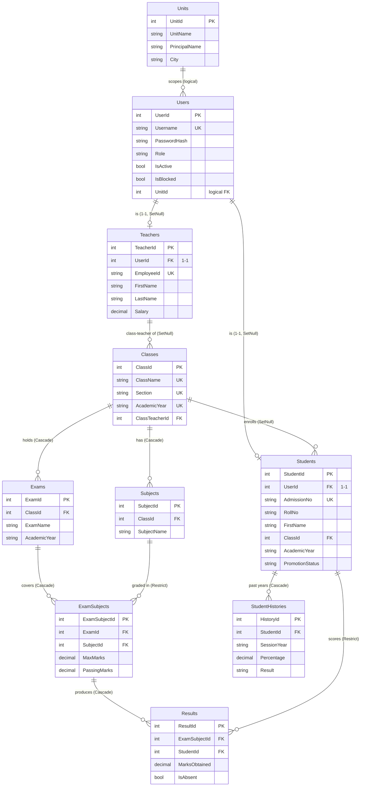
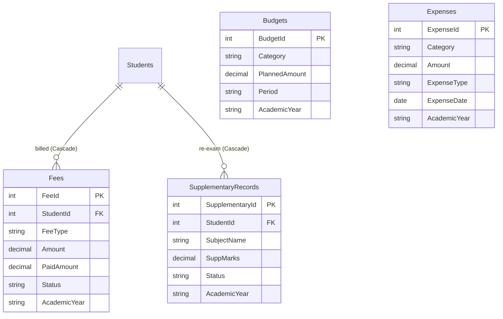
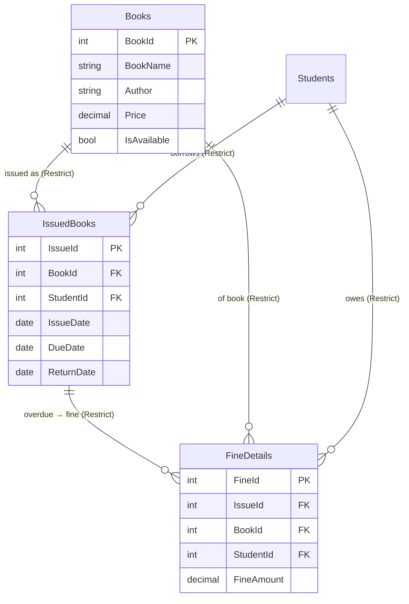
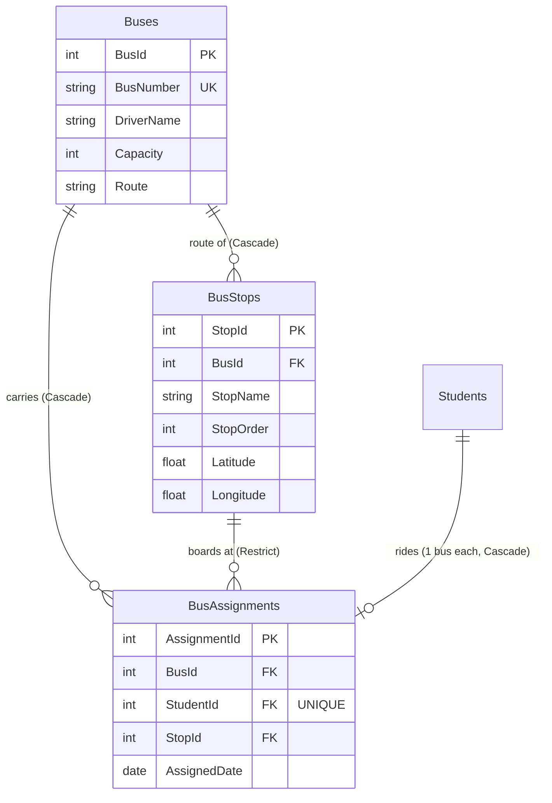
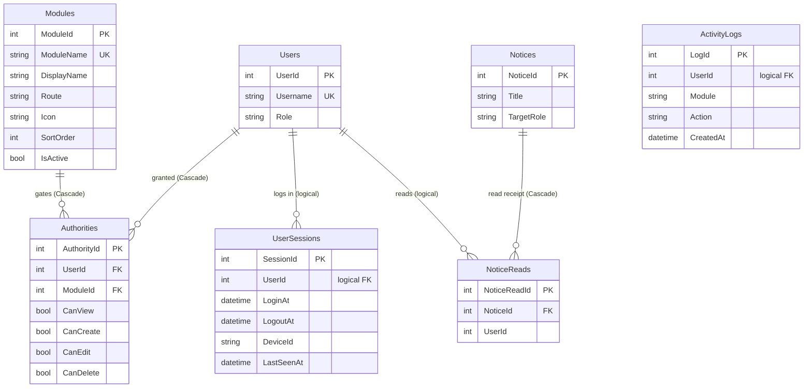
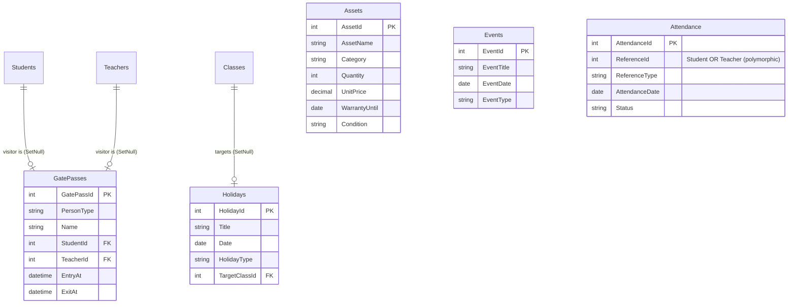

# School ERP — Entity-Relationship Diagram

> 31 tables. Diagram rendered with **Mermaid** — it displays automatically on GitHub, in VS Code
> (with the *Markdown Preview Mermaid* extension), and on any Mermaid-aware viewer.
>
> **Legend**
> - **Solid line** (`||--o{`) = a real foreign-key constraint enforced in the database.
> - **Dotted line** (`..o{`) = a *logical* reference (the column points at another table by
>   business rule, but there is **no** DB-level FK constraint — e.g. every `UnitId`, and the
>   polymorphic `Attendance.ReferenceId`). These are enforced only in application code.
> - `PK` = primary key, `FK` = foreign key, `UK` = unique key.

---

## 1) Core academic backbone

The heart of the system: **Units → Users → Students / Teachers → Classes → Exams → Results**.

---

## 2) Fees, Finance & Promotion

> **Budgets** and **Expenses** are standalone finance ledgers (no FK to other tables) — they are
> grouped by `Category` + `AcademicYear` in the Finance module. Fee income vs. Expenses drives the
> profit/loss reports.

---

## 3) Library

---

## 4) Transport

> `BusAssignments.StudentId` is **UNIQUE** → a student can be on at most one bus. This join table is
> the *single source of truth* for a student's bus (there is no `Student.BusId` column).

---

## 5) RBAC (permissions), sessions & activity

> **`Authorities`** is the whole RBAC system: one row per (User × Module) with 4 boolean flags.
> `[RequirePermission("Module", Action)]` on each endpoint checks exactly this table — **no role is
> ever hard-coded**. `Modules` drives the sidebar (`IsActive` + `SortOrder`).

---

## 6) Standalone / operational tables

These tables are gated by their own module but link to the rest only *logically* (mostly via `UnitId`
and optional creator ids):

> **`Attendance`** is polymorphic: `ReferenceId` points at a **Student** or a **Teacher** depending
> on `ReferenceType` — so there is no single FK. It is uniquely keyed on
> `(ReferenceId, ReferenceType, AttendanceDate)`.
>
> **`Assets`** (Inventory) and **`Events`** stand alone except for the multi-tenant `UnitId`.

---

## Multi-tenant note (`UnitId`)

Almost every operational table carries a nullable **`UnitId`** that logically points to `Units`.
There is **no DB foreign-key** on any of these — unit isolation is enforced entirely in application
code via the `UnitScope` helper (a SuperAdmin sees all units; every other user is narrowed to their
own `UnitId`). Tables with a logical `UnitId`: Users, Classes, Teachers, Students, Fees, Attendance,
Buses, Events, Subjects, Exams, Books, Notices, Holidays, GatePasses, Budgets, Expenses,
SupplementaryRecords, Assets.
